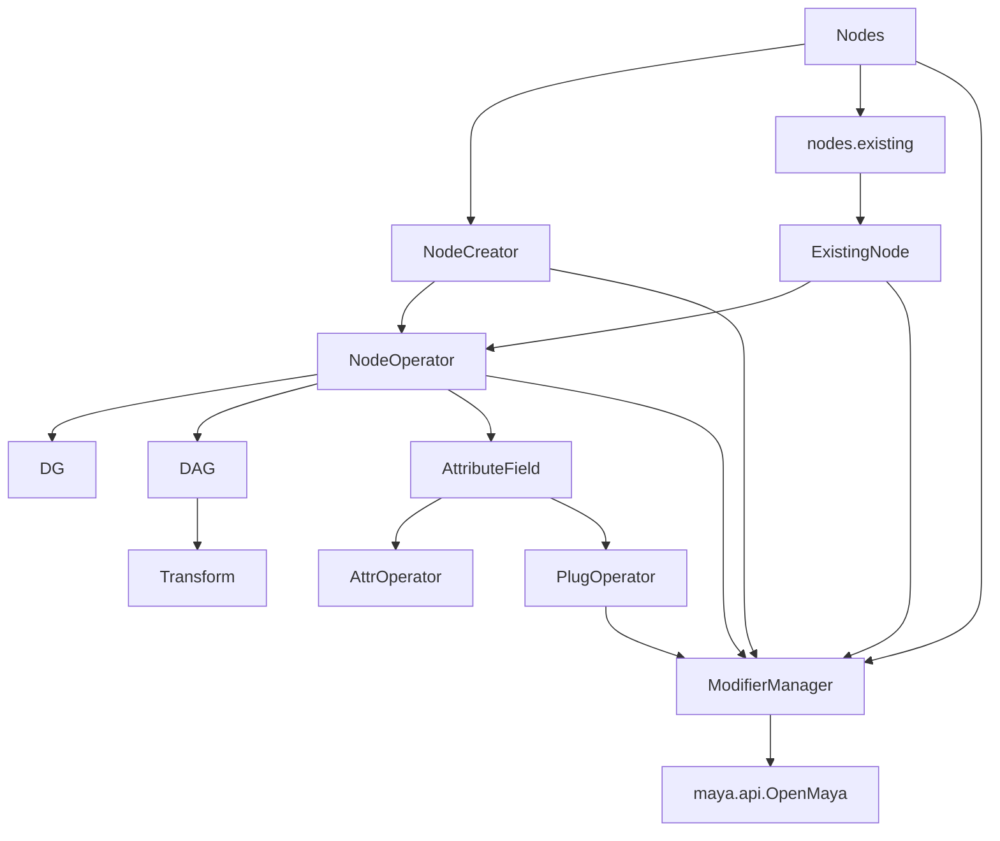

# NodeOperator

このドキュメントは、`bd_util.maya.node.operator` 周辺の現行仕様を共有するためのメモです。

対象は Maya 2025 / Python 3.11.4 以降です。まだ 1.0.0 前の開発中 API として扱い、利便性と OpenMaya に近い速度の両立を優先します。

## 目的

`NodeOperator` は Maya ノード操作を Python から扱いやすくするためのラッパーです。

主な狙いは次の通りです。

- `maya.api.OpenMaya` を直接使うより記述量を減らす。
- `maya.cmds` / PyMEL より型とアクセス経路を明確にする。
- ノード、アトリビュート、プラグ、modifier の責務を分ける。
- 速度面では生の OpenMaya にできるだけ近づける。
- 将来 MPxCommand で undo / redo を組み込めるようにする。

## 主要ファイル

- `python/bd_util/maya/node/operator/node/_core.py`
  - `NodeOperator` の基底クラスです。
- `python/bd_util/maya/node/operator/node/dg/_core.py`
  - DG ノード共通の基底クラスです。
- `python/bd_util/maya/node/operator/node/dag/_core.py`
  - DAG ノード共通の基底クラスです。
- `python/bd_util/maya/node/operator/node/dag/transform/_core.py`
  - 手書きの公開 `Transform` クラスと、Transform 固有の操作 API です。
- `python/bd_util/maya/node/operator/node/dg/_generated`
  - DG NodeOperator の自動生成 class を置く package です。
- `python/bd_util/maya/node/operator/node/dag/_generated`
  - DAG NodeOperator の自動生成 class を置く package です。
- `python/bd_util/maya/node/operator/node/dag/transform/_generated`
  - Generator が出力する `GeneratedTransform` と Transform 派生 NodeOperator の生成 class です。
- `python/bd_util/maya/node/operator/node/dag/shape/_generated`
  - Shape NodeOperator の自動生成 class を置く package です。
- `python/bd_util/maya/node/operator/node/dg/<node_type>.py`
  - 生成 class を継承する手書き可能な公開 wrapper です。Transform / Shape 派生 node も同じ分離方針です。
- `python/bd_util/maya/node/operator/attr/_core.py`
  - `AttributeField` / `AttrOperator` / `PlugOperator` の中核です。
- `python/bd_util/maya/node/operator/attr/extra/add_attr.py`
  - extra attribute 作成用の `AddAttr` API です。
- `python/bd_util/maya/node/operator/attr/lookup.py`
  - Maya 上の既存アトリビュートから対応する `AttrOperator` を推定します。
- `python/bd_util/maya/node/modifier/_core.py`
  - `ModifierManager` です。
- `python/bd_util/maya/node/nodes.py`
  - `Nodes` です。ノード作成と既存ノード変換で同じ `ModifierManager` を共有する統合入口です。
- `python/bd_util/maya/node/creator/_core.py`
  - `nodes.create` を構成する内部実装の `NodeCreator` です。
- `python/bd_util/maya/node/existing_node.py`
  - `nodes.existing` を構成する内部実装の `ExistingNode` です。

## 基本構成



## アクセスモデル

`AttributeField` は descriptor として動作します。

同じフィールドでも、アクセス元によって返すものが変わります。

- `SomeNode.someAttr`
  - クラスアクセスです。
  - `AttrOperator` を返します。
- `node.someAttr`
  - ノードインスタンスからのアクセスです。
  - `PlugOperator` を返します。
- `node.compound.child`
  - compound plug から子 plug へのアクセスです。
  - 子の `PlugOperator` を返します。

`short_name` alias は同じ plug instance を返す方針です。

```python
node.output3D is node.o3
node.output3D.output3Dx is node.output3Dx
node.input3D[0] is node.input3D[0]
```

## NodeOperator の生成

`Nodes` は、ノード作成と既存ノード変換を一つの `ModifierManager` から扱う推奨入口です。

```python
from maya import cmds
import bd_util as bdu

cmds.createNode("transform", name="existing_node")

modifier_manager = bdu.ModifierManager()
nodes = bdu.Nodes(modifier_manager=modifier_manager)

created = nodes.create.transform(name="new_node")
existing = nodes.existing.transform("existing_node")

modifier_manager.do_it_dag()
```

`nodes.create` は、共有 `ModifierManager` を使うノード作成アクセサです。
`nodes.existing` は、同じ `ModifierManager` を使う既存ノードアクセサです。
したがって、各呼び出しで `modifier_manager=` を繰り返す必要はありません。

```python
assert created.modifier_manager is modifier_manager
assert existing.modifier_manager is modifier_manager
```

既存ノードの nodeType を自動判定する場合は、`nodes.existing` 自体を呼び出します。

```python
existing = nodes.existing("existing_node")
```

`NodeCreator` / `ExistingNode` は `Nodes` の内部実装として維持しますが、`bd_util` の公開APIには含めません。
ノード作成と既存ノード変換は、どちらも `Nodes` から利用します。

ノード作成は `ModifierManager` を受け取ります。

```python
from bd_util.maya.node.modifier import ModifierManager
from bd_util.maya.node.operator.node.dg.plus_minus_average import PlusMinusAverage

modifier_manager = ModifierManager()

node = PlusMinusAverage.create(modifier_manager, name="test_pma")
modifier_manager.do_it_dg()
```

複数のノード型を扱う場合は、個別の `NodeOperator` クラスを毎回 import せず、`nodes.create` から作成できます。

```python
import bd_util as bdu

modifier_manager = bdu.ModifierManager()
nodes = bdu.Nodes(modifier_manager=modifier_manager)

pma = nodes.create.plusMinusAverage(name="plus_minus_ave")
mult_div = nodes.create.multiplyDivide(name="mult_div")

modifier_manager.do_it_dg()
```

内部の `NodeCreator` は DG ノード名、transform 系 DAG ノード名、作成確認済みの
shape ノード名を lazy import し、`NodeOperator.create()` を呼びます。
生成メソッド名は `multiplyDivide` のような Maya nodeType 名に合わせています。
`create()` には `plus_minus_average` のような snake_case と、`multiplyDivide` のような Maya nodeType 名のどちらでも渡せます。
IDE 補完用に `.pyi` を用意し、主要な生成メソッドの戻り型が各 `NodeOperator` クラスとして見えるようにしています。

`transform` / `joint` は `nodes.create` から作成できます。
作成時の親は `parent=` で指定でき、親子を同じ `MDagModifier` に積めます。

```python
import bd_util as bdu

mod = bdu.ModifierManager()
nodes = bdu.Nodes(modifier_manager=mod)

parent = nodes.create.transform(name="parent")
child = nodes.create.transform(name="child", parent=parent)

mod.do_it_dag()
```

shape 系ノードは、親 `Transform` を必須として作成します。親を省略して Maya に
Transform を自動生成させる経路は公開しません。

```python
import bd_util as bdu

mod = bdu.ModifierManager()
nodes = bdu.Nodes(modifier_manager=mod)

transform = nodes.create.transform(name="mesh")
mesh = nodes.create.mesh(
    name="meshShape",
    parent=transform,
)

mod.do_it_dag()
```

transform と shape を一度に用意する場合は、`nodes.create.with_transform` を使います。
戻り値は `(Transform, concrete Shape)` の順で、両方が同じ `ModifierManager` に
積まれます。`name` は transform 名を表し、`shape_name` を省略すると
`{name}Shape` が使われます。

```python
import bd_util as bdu

mod = bdu.ModifierManager()
nodes = bdu.Nodes(modifier_manager=mod)

transform, mesh = nodes.create.with_transform.mesh(name="mesh")

mod.do_it_dag()
```

明示的な shape 名や、作成する transform の親も指定できます。

```python
group = nodes.create.transform(name="group")
transform, camera = nodes.create.with_transform.camera(
    name="camera",
    shape_name="renderCameraShape",
    parent=group,
)

mod.do_it_dag()
```

`nodes.create.mesh(parent=transform)` は親必須の raw shape 作成として維持します。
一括作成は `nodes.create.with_transform.mesh()` という別入口にすることで、
既存 API と transform 自動生成の意図を区別しています。

### raw shape 作成と一括作成を分ける理由

2つの入口は、作成するノード数だけでなく、引数と戻り値の意味も異なります。

| API | 作成対象 | `name` | `parent` | 戻り値 |
| --- | --- | --- | --- | --- |
| `nodes.create.locator(parent=transform)` | Shapeのみ | Shape名 | Shapeの親Transform。必須 | `Locator` |
| `nodes.create.with_transform.locator()` | Transform + Shape | Transform名 | 新規Transformの親。任意 | `tuple[Transform, Locator]` |

`nodes.create.locator()` の `parent` を省略可能にし、その有無で処理を切り替える
overload も技術的には実装できます。ただし、その設計では次の問題が生じます。

- `parent` の指定漏れがエラーにならず、意図しない Transform 作成へ変わる。
- 同じメソッドの戻り値が `Locator` または `tuple[Transform, Locator]` になる。
- `parent: Transform | None` を渡すと戻り値も union になり、利用側で型の絞り込みが必要になる。
- `name` と `parent` の意味が、同じメソッド内で条件によって変わる。
- scene に1ノードを作る操作と2ノードを作る操作を、呼び出しから判別しにくい。

戻り値を常に Shape のみにすれば union は避けられますが、自動作成した Transform を
直接受け取れません。また、Transform の作成が呼び出し側から見えにくくなります。

そのため、raw API は親の指定漏れを検出し、常に具体 Shape 型を返す入口として固定します。
一括作成 API は Transform の生成を明示し、常に
`tuple[Transform, concrete Shape]` を返す別入口として固定します。

現在 `nodes.create` から作成できる shape は、動作確認済みの次の80種類です。

- `aiAreaLight`
- `aiCurveCollector`
- `aiLightBlocker`
- `aiLightPortal`
- `aiMeshLight`
- `aiPhotometricLight`
- `aiSkyDomeLight`
- `aiStandIn`
- `aiVolume`
- `ambientLight`
- `angleDimension`
- `annotationShape`
- `arcLengthDimension`
- `areaLight`
- `baseLattice`
- `bezierCurve`
- `camera`
- `clusterFlexorShape`
- `clusterHandle`
- `deformBend`
- `deformFlare`
- `deformSine`
- `deformSquash`
- `deformTwist`
- `deformWave`
- `directedDisc`
- `directionalLight`
- `distanceDimShape`
- `dropoffLocator`
- `dynamicConstraint`
- `dynHolder`
- `environmentFog`
- `flexorShape`
- `fluidShape`
- `fluidTexture2D`
- `fluidTexture3D`
- `follicle`
- `geoConnectable`
- `greasePlane`
- `greasePlaneRenderShape`
- `hairConstraint`
- `hairSystem`
- `heightField`
- `hikFloorContactMarker`
- `imagePlane`
- `implicitBox`
- `implicitCone`
- `implicitSphere`
- `lattice`
- `lineModifier`
- `locator`
- `mesh`
- `motionTrailShape`
- `nCloth`
- `nParticle`
- `nRigid`
- `nurbsCurve`
- `nurbsSurface`
- `orientationMarker`
- `paramDimension`
- `particle`
- `pfxHair`
- `pfxToon`
- `pointLight`
- `positionMarker`
- `renderBox`
- `renderCone`
- `renderRect`
- `renderSphere`
- `rigidBody`
- `sketchPlane`
- `snapshotShape`
- `softModHandle`
- `spotLight`
- `spring`
- `stereoRigCamera`
- `stroke`
- `subdiv`
- `ufeProxyCameraShape`
- `volumeLight`

Maya 標準 light shape 6種は、指定した親 Transform と名前での作成、および
同じ `ModifierManager` に積んだ一括 undo / redo を Maya 2025 上で確認済みです。
MtoA ロード時は、各 light に生成されている Arnold attribute も戻り値型から利用できます。

Arnold 固有 light shape 5種は MtoA のロードを前提とし、指定した親 Transform と
名前での作成、および一括 undo / redo を Maya 2025 + MtoA 上で確認済みです。

残る Arnold 固有 shape 4種も、MtoA ロード下で raw shape としての作成と
undo / redo を確認済みです。`aiStandIn.dso` や `aiVolume.filename` の値設定、
geometry・shader 接続など、用途別の初期化はこの API では自動実行しません。

Maya 標準 geometry shape の `baseLattice` / `bezierCurve` / `lattice` / `subdiv`
も、raw shape としての作成と undo / redo を確認済みです。geometry データや
lattice 分割数などの内容初期化は自動実行しません。

Maya 標準 primitive shape の `implicitBox` / `implicitCone` / `implicitSphere` /
`renderBox` / `renderCone` / `renderRect` / `renderSphere` も、raw shape としての
作成と undo / redo を確認済みです。size や radius などの値設定は自動実行しません。

Maya 標準の計測・注釈 shape `angleDimension` / `annotationShape` /
`arcLengthDimension` / `distanceDimShape` / `paramDimension` も、raw shape としての
作成と undo / redo を確認済みです。計測点、表示テキスト、NURBS geometry との接続
など、用途別の初期化は自動実行しません。

Maya 標準の補助 locator・marker・handle shape `clusterHandle` / `directedDisc` /
`dropoffLocator` / `hikFloorContactMarker` / `motionTrailShape` /
`orientationMarker` / `positionMarker` / `softModHandle` も、raw shape としての作成と
undo / redo を確認済みです。deformer、motion path、HIK などとの接続や用途別の
初期化は自動実行しません。生成済みの `SphereLocator` class は Maya 2025 の
標準状態で node type を作成できないため、`nodes.create` へは公開していません。

Maya 標準の非線形 deformer 表示 shape `deformBend` / `deformFlare` /
`deformSine` / `deformSquash` / `deformTwist` / `deformWave` も、raw shape としての
作成と undo / redo を確認済みです。対応する deformer node との接続や
`deformerData` の初期化は自動実行しません。

Maya 標準の deformation connection helper shape `clusterFlexorShape` /
`flexorShape` / `geoConnectable` も、raw shape としての作成と undo / redo を
確認済みです。driver、flexor、surface geometry などとの接続は自動実行しません。

Maya 標準のシーン表示・カメラ補助 shape `imagePlane` / `sketchPlane` /
`snapshotShape` / `stereoRigCamera` も、raw shape としての作成と undo / redo を
確認済みです。画像ファイル、描画内容、snapshot frame、stereo camera 接続などの
用途別初期化は自動実行しません。

Maya 標準の UFE proxy camera shape `ufeProxyCameraShape` も、標準起動状態での
raw shape 作成と undo / redo を確認済みです。UFE scene item や camera との関連付けなど、
用途別初期化は自動実行しません。

Maya 標準のレンダリング・環境表現補助 shape `environmentFog` / `fluidTexture2D` /
`fluidTexture3D` / `heightField` も、raw shape としての作成と undo / redo を
確認済みです。camera、fluid data、texture、displacement などとの接続や
用途別初期化は自動実行しません。

Maya 標準の描画・Paint Effects 補助 shape `greasePlane` /
`greasePlaneRenderShape` / `lineModifier` / `pfxHair` / `pfxToon` / `stroke` も、
raw shape としての作成と undo / redo を確認済みです。image、brush、hair / toon
input、render geometry、line modifier などの接続や用途別初期化は自動実行しません。

Maya 標準の hair・dynamics 補助 shape `dynamicConstraint` / `dynHolder` / `follicle` /
`hairConstraint` / `hairSystem` / `spring` も、raw shape としての作成と undo / redo を
確認済みです。simulation設定、constraint component、hair curve、surface、solver
などとの接続や用途別初期化は自動実行しません。

Maya 標準の simulation body shape `fluidShape` / `nCloth` / `nParticle` / `nRigid` /
`particle` / `rigidBody` も、raw shape としての作成と undo / redo を確認済みです。
geometry・particle data、initial state、nucleus・rigid solver などとの接続や用途別初期化は
自動実行しません。

Maya 2025 + MtoA の concrete shape 81種は class 生成済みで、
`nodes.existing.<nodeType>()` から具体的な戻り値型として利用できます。
このうち80種は作成確認済みで、`nodes.create` へ公開しています。残る
`SphereLocator` は Maya 2025 の標準状態で node type が登録されていないため、
非公開のまま維持します。
`polyCube` のように Transform、Shape、history node をまとめて作る操作は、raw shape
作成とは別の高レベル API として扱います。

## DAG の親子操作

`DAG.parent` は直接の親を返し、ワールド直下では `None` を返します。
`DAG.parents` は直接の親を tuple で返し、ワールドは含めません。

```python
parent = child.parent
parents = child.parents
is_instanced = child.is_instanced
```

親変更は `set_parent()` で現在の `MDagModifier` に積みます。
初期値では local transform を維持するため、親の transform に応じて world transform が変わります。

```python
child.set_parent(parent)
mod.do_it_dag()
```

`Transform.set_parent()` では、親変更時の world transform を維持できます。
自身または自身の子孫を親にする循環操作は、同じ `ModifierManager` に積まれた
未実行の作成・親変更も含め、modifierへ積む前に拒否します。

```python
child.set_parent(
    parent,
    preserve_world_transform=True,
)
mod.do_it_dag()
```

ワールド直下への親変更は Transform 専用です。

```python
child.set_parent_to_world()
mod.do_it_dag()
```

world transform を維持する場合は、次のように指定します。

```python
child.set_parent_to_world(preserve_world_transform=True)
mod.do_it_dag()
```

インスタンス DAG は階層パスが複数あるため、`parent`、`set_parent()`、`set_parent_to_world()` は `RuntimeError` にします。
すべての直接の親を調べる場合は `parents` を使用します。

`full_path` は保持中の `MDagPath` からアクセスごとに取得します。
親変更や rename の確定、および undo / redo 後も現在のフルパスを返します。

## DAG の行列変換

`DAG` は、2つのDAGノード間で行列を変換する共通メソッドを持ちます。

```python
relative_tm = src_dag.get_relative_matrix(dst_dag)
local_tm = src_dag.get_local_matrix(dst_dag)
```

- `get_relative_matrix(dst_dag)`
  - src の行列を dst 自身の空間で表した `TransformMatrix` を返します。
  - `src.worldMatrix * dst.worldInverseMatrix` に相当します。
- `get_local_matrix(dst_dag)`
  - src の `worldMatrix` を再現するdst用local行列を返します。
  - `src.worldMatrix * dst.parentInverseMatrix` に相当します。
  - `parentInverseMatrix` を通じて、dst の `offsetParentMatrix` も補正されます。

どちらも各 `MDagPath.instanceNumber()` に対応する matrix plug を使います。戻り値の分解方法とmatrix plugからの直接取得については、[TransformMatrix](../transform_matrix.md) を参照してください。

シーン上に既に存在するノードは `nodes.existing` で対応する `NodeOperator` に変換できます。

```python
from maya import cmds

import bd_util as bdu

cmds.createNode("plusMinusAverage", name="test_plus_minus_ave")

nodes = bdu.Nodes()
node = nodes.existing("test_plus_minus_ave")
node.input1D[0].set(10.0)
nodes.modifier_manager.do_it_dg()
```

`nodes.existing` は既存ノードを包むだけなので、初期値では extra attribute を自動追加しません。
必要な場合は `nodes.existing("nodeName", auto_add_attr=True)` のように指定します。

内部の `ExistingNode` は生成済みの DG / DAG / transform / shape class から node type を解決します。
そのため、既存の mesh shape や camera shape も対応する `NodeOperator` として包めます。

nodeType を呼び出し側で明示したい場合は、`nodes.existing` の型別メソッドを使用できます。

```python
import bd_util as bdu

modifier_manager = bdu.ModifierManager()
nodes = bdu.Nodes(modifier_manager=modifier_manager)
node = nodes.existing.decomposeMatrix("test_decompose_matrix")
```

型別メソッドは実行時に対象 class を lazy import し、`existing_node.pyi` では通常の nodeType に対して具体的な戻り値型を公開します。
`nodes.existing` についても `nodes.pyi` で同じ具体的な戻り値型を公開します。
この例の `node` は IDE 上でも `DecomposeMatrix` として扱われます。
Maya 上の実際の nodeType が指定したメソッドと異なる場合は `TypeError` を送出します。
自動判定する `nodes.existing("nodeName")` と型を明示する `nodes.existing.decomposeMatrix("nodeName")` は、同じ既存ノード変換処理を共有します。

transform 派生 node は、既存 node の具体型対応と作成 API を分けて段階公開します。
`ikHandle` / `ikEffector` は `nodes.existing.ikHandle()` /
`nodes.existing.ikEffector()` から具体型として利用できますが、作成には専用の
初期化手順が必要なため `nodes.create` には公開しません。
constraint 系14種も `nodes.existing.aimConstraint()` /
`nodes.existing.parentConstraint()` などから具体型として利用できます。
これらも専用 command や接続を伴うため `nodes.create` には公開しません。
field / emitter 系11種も `nodes.existing.airField()` /
`nodes.existing.fluidEmitter()` などから具体型として利用できます。
これらも dynamics 用の初期化や接続を伴うため `nodes.create` には公開しません。
dynamics / deformer 周辺の5種も `nodes.existing.nucleus()` /
`nodes.existing.primitiveFalloff()` などから具体型として利用できます。
これらも専用の作成手順や接続を伴うため `nodes.create` には公開しません。
HIK 系5種も `nodes.existing.hikFKJoint()` /
`nodes.existing.hikHandle()` などから具体型として利用できます。
`HikFKJoint` は `Joint`、`HikHandle` は `IkHandle` の継承関係も維持します。
scene / utility 系6種も `nodes.existing.dagContainer()` /
`nodes.existing.lookAt()` などから具体型として利用できます。
`LookAt` はnative継承に合わせて `AimConstraint` の派生型として扱います。
VarGroup 系5種も `nodes.existing.curveVarGroup()` /
`nodes.existing.meshVarGroup()` などから具体型として利用できます。
5種共通の抽象native基底は `BaseGeometryVarGroup` として型階層に保持します。
特殊transformの `ufeProxyTransform` / `unknownTransform` も
`nodes.existing` から具体型として利用できます。`UfeProxyTransform` では、
各instanceへ追加される `ufePath` も静的なfieldとして公開します。

`NodeOperator` は内部で `m_obj` と lazy な `MFnDependencyNode` を持ちます。

`fn_node` は初回アクセス時に作られ、以降はキャッシュされます。

## キャッシュ方針

速度改善のため、次のものをキャッシュしています。

- `NodeOperator.fn_node`
- `NodeOperator._plug_cache`
- `PlugOperator.plug`
- indexed plug access の `plug[index]`
- `connect_next_index()` 用の next index

alias や child plug は同じ logical plug を指す場合、同じ `PlugOperator` instance を返すことを重視します。

## 文字列アクセス

現状の `NodeOperator.__getitem__()` は `getattr(self, key)` 相当です。

過去には `"attrName[0].subAttr"` のような文字列パス解析を想定していた形跡がありますが、現時点では active な仕様ではありません。

## 関連ドキュメント

- [attributes.md](attributes.md)
- [core.md](core.md)
- [generator.md](generator.md)
- [modifier_manager.md](modifier_manager.md)
- [testing.md](testing.md)
- [roadmap.md](roadmap.md)
