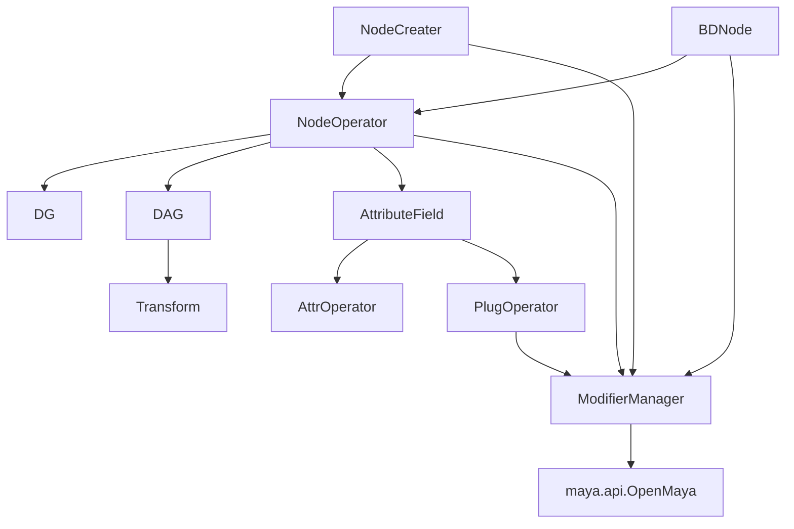

# NodeOperator

このドキュメントは、`bd_util.maya.node.operator` 周辺の現行仕様を共有するためのメモです。

対象は Maya 2025 / Python 3.11.4 以降です。まだ 1.0.0 前の開発中 API として扱い、利便性と OpenMaya に近い速度の両立を優先します。

## 目的

`NodeOperator` は Maya ノード操作を Python から扱いやすくするためのラッパーです。

主な狙いは次の通りです。

- `maya.api.OpenMaya` を直接使うより記述量を減らす。
- `maya.cmds` / PyMEL より型とアクセス経路を明確にする。
- ノード、アトリビュート、プラグ、modifier の責務を分ける。
- 速度面では生の OpenMaya にできるだけ近づける。
- 将来 MPxCommand で undo / redo を組み込めるようにする。

## 主要ファイル

- `python/bd_util/maya/node/operator/node/_core.py`
  - `NodeOperator` の基底クラスです。
- `python/bd_util/maya/node/operator/node/dg/_core.py`
  - DG ノード共通の基底クラスです。
- `python/bd_util/maya/node/operator/node/dag/_core.py`
  - DAG ノード共通の基底クラスです。
- `python/bd_util/maya/node/operator/node/dag/transform/_core.py`
  - `Transform` ノード定義です。
- `python/bd_util/maya/node/operator/attr/_core.py`
  - `AttributeField` / `AttrOperator` / `PlugOperator` の中核です。
- `python/bd_util/maya/node/operator/attr/extra/add_attr.py`
  - extra attribute 作成用の `AddAttr` API です。
- `python/bd_util/maya/node/operator/attr/lookup.py`
  - Maya 上の既存アトリビュートから対応する `AttrOperator` を推定します。
- `python/bd_util/maya/node/modifier/_core.py`
  - `ModifierManager` です。
- `python/bd_util/maya/node/creater/_core.py`
  - `NodeCreater` です。ノードクラスの個別 import を減らすための生成入口です。
- `python/bd_util/maya/node/bd_node.py`
  - `BDNode` です。シーン上に既に存在するノードを対応する `NodeOperator` として包む入口です。

## 基本構成



## アクセスモデル

`AttributeField` は descriptor として動作します。

同じフィールドでも、アクセス元によって返すものが変わります。

- `SomeNode.someAttr`
  - クラスアクセスです。
  - `AttrOperator` を返します。
- `node.someAttr`
  - ノードインスタンスからのアクセスです。
  - `PlugOperator` を返します。
- `node.compound.child`
  - compound plug から子 plug へのアクセスです。
  - 子の `PlugOperator` を返します。

`short_name` alias は同じ plug instance を返す方針です。

```python
node.output3D is node.o3
node.output3D.output3Dx is node.output3Dx
node.input3D[0] is node.input3D[0]
```

## NodeOperator の生成

ノード作成は `ModifierManager` を受け取ります。

```python
from bd_util.maya.node.modifier import ModifierManager
from bd_util.maya.node.operator.node.dg.plus_minus_average import PlusMinusAverage

modifier_manager = ModifierManager()

node = PlusMinusAverage.create(modifier_manager, name="test_pma")
modifier_manager.do_it_dg()
```

複数のノード型を扱う場合は、個別の `NodeOperator` クラスを毎回 import せず、`NodeCreater` から作成できます。

```python
from bd_util import ModifierManager, NodeCreater

modifier_manager = ModifierManager()
node_creater = NodeCreater(modifier_manager=modifier_manager)

pma = node_creater.plusMinusAverage(name="plus_minus_ave")
mult_div = node_creater.multiplyDivide(name="mult_div")

modifier_manager.do_it_dg()
```

`NodeCreater` は DG ノード名と transform 系 DAG ノード名を lazy import し、内部で `NodeOperator.create()` を呼びます。
生成メソッド名は `multiplyDivide` のような Maya nodeType 名に合わせています。
`create()` には `plus_minus_average` のような snake_case と、`multiplyDivide` のような Maya nodeType 名のどちらでも渡せます。
IDE 補完用に `.pyi` を用意し、主要な生成メソッドの戻り型が各 `NodeOperator` クラスとして見えるようにしています。

`transform` / `joint` は `NodeCreater` から作成できます。
shape 系ノードは transform 親の扱いが絡むため、現時点では作成 API には出していません。
ただし `BDNode` 用の class 解決対象には含めています。

シーン上に既に存在するノードは `BDNode` で対応する `NodeOperator` に変換できます。

```python
from maya import cmds

from bd_util import BDNode

cmds.createNode("plusMinusAverage", name="test_plus_minus_ave")

node = BDNode("test_plus_minus_ave")
node.input1D[0].set(10.0)
node.modifier_manager.do_it_dg()
```

`BDNode` は既存ノードを包むだけなので、初期値では extra attribute を自動追加しません。
必要な場合は `BDNode("nodeName", auto_add_attr=True)` のように指定します。

`BDNode` は生成済みの DG / DAG / transform / shape class から node type を解決します。
そのため、既存の mesh shape や camera shape も対応する `NodeOperator` として包めます。

nodeType を呼び出し側で明示したい場合は、`BDNode` の型別メソッドを使用できます。

```python
import bd_util as bdu

modifier_manager = bdu.ModifierManager()
node = bdu.BDNode.decomposeMatrix(
    "test_decompose_matrix",
    modifier_manager=modifier_manager,
)
```

型別メソッドは実行時に対象 class を lazy import し、`bd_node.pyi` では通常の nodeType に対して具体的な戻り値型を公開します。
この例の `node` は IDE 上でも `DecomposeMatrix` として扱われます。
Maya 上の実際の nodeType が指定したメソッドと異なる場合は `TypeError` を送出します。
自動判定する `BDNode("nodeName")` と型を明示する `BDNode.decomposeMatrix("nodeName")` は、同じ既存ノード変換処理を共有します。

`NodeOperator` は内部で `m_obj` と lazy な `MFnDependencyNode` を持ちます。

`fn_node` は初回アクセス時に作られ、以降はキャッシュされます。

## キャッシュ方針

速度改善のため、次のものをキャッシュしています。

- `NodeOperator.fn_node`
- `NodeOperator._plug_cache`
- `PlugOperator.plug`
- indexed plug access の `plug[index]`
- `connect_next_index()` 用の next index

alias や child plug は同じ logical plug を指す場合、同じ `PlugOperator` instance を返すことを重視します。

## 文字列アクセス

現状の `NodeOperator.__getitem__()` は `getattr(self, key)` 相当です。

過去には `"attrName[0].subAttr"` のような文字列パス解析を想定していた形跡がありますが、現時点では active な仕様ではありません。

## 関連ドキュメント

- [attributes.md](attributes.md)
- [core.md](core.md)
- [generator.md](generator.md)
- [modifier_manager.md](modifier_manager.md)
- [testing.md](testing.md)
- [roadmap.md](roadmap.md)
