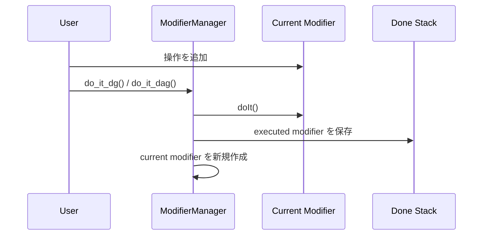

# ModifierManager

`ModifierManager` は `MDGModifier` と `MDagModifier` をまとめて扱うための管理クラスです。

目的は、複数の DG / DAG 操作を 1 つの作業単位として undo / redo できるようにすることです。

## 基本方針

`MDGModifier` / `MDagModifier` は操作を溜めて `doIt()` で確定する command buffer として扱います。

一度 `doIt()` した modifier は閉じた履歴として保存し、次の操作には新しい modifier を使います。

`ModifierManager` 全体では、それら複数の modifier をまとめて 1 つのコマンド履歴として扱います。

## lifecycle



## public API

```python
modifier_manager.dg_mod
modifier_manager.dag_mod
modifier_manager.do_it_dg()
modifier_manager.do_it_dag()
modifier_manager.undo_it()
modifier_manager.redo_it()
modifier_manager.clear()
modifier_manager.rollback()
```

`record_pending_dag_parent()` と `would_create_dag_cycle()` は、
DAG `NodeOperator` が未実行の親関係を管理するための連携 API です。
通常の利用コードから直接呼ぶ必要はありません。

## 使用例

```python
from bd_util.maya.node.modifier import ModifierManager
from bd_util.maya.node.operator.node.dg.plus_minus_average import PlusMinusAverage

modifier_manager = ModifierManager()

node = PlusMinusAverage.create(modifier_manager, name="test_pma")
node.input1D[0].set(1.0)
node.input1D[1].set(2.0)

modifier_manager.do_it_dg()

modifier_manager.undo_it()
modifier_manager.redo_it()
```

## DG / DAG の混在

DG と DAG の操作は 1 つの `ModifierManager` に混在できます。

ただし `MDGModifier` に溜まった操作は `do_it_dg()`、`MDagModifier` に溜まった操作は `do_it_dag()` で確定します。

undo 時は実行済み modifier を逆順に `undoIt()` します。

redo 時は undo 済み modifier を順番に `doIt()` します。

## 未実行の DAG 親関係

DAG `NodeOperator` 経由の作成・親変更では、現在の `MDagModifier` に積まれた
未実行の直接親を `ModifierManager` が内部的に記録します。
現在のシーン階層とこの記録を組み合わせることで、未作成ノードを含む循環した
親変更を `do_it_dag()` より前に拒否します。

この記録は `do_it_dag()` の成功後、または `clear()` で破棄します。

## redo の扱い

`undo_it()` 後、`redo_it()` を呼ぶと履歴を再実行します。

新しい `do_it_dg()` / `do_it_dag()` が実行されると redo stack は破棄されます。

これは一般的な undo / redo と同じ扱いです。

## modifier実行中の失敗

`do_it_dg()` / `do_it_dag()`の途中で例外が発生した場合は、失敗したmodifier自体の
`undoIt()`を呼び、その実行内ですでに反映された変更の復元を試みます。失敗した操作を
再実行しないよう、DG / DAG両方のpending操作、未実行の親関係、redo履歴を破棄します。
それ以前に成功したmodifier履歴は保持するため、直接利用する呼び出し側は
`undo_it()`や`rollback()`でその履歴も戻せます。

`redo_it()`の途中で失敗した場合も、失敗したmodifierの部分変更を復元し、残りのredoと
pending操作を破棄します。それまでに再実行が成功した履歴はundo可能な状態で保持します。

失敗したmodifierの復元自体でも例外が発生した場合は、元の実行例外へnoteを付加して
再送出します。この場合は変更が残る可能性があります。破棄された失敗modifierを
managerから再実行したり、再度undoしたりはしません。

## clear

`clear()` は現在の modifier、done stack、redo stack をすべて初期化します。

テストや一時的な作業単位を破棄したい場合に使います。

## MPxCommand との関係

`MPxCommandBase`はcommandごとに一つの`ModifierManager`と、それを共有する`Nodes`を
保持します。command側の`undoIt()`では`modifier_manager.undo_it()`、`redoIt()`では
`modifier_manager.redo_it()`を呼びます。

初回実行の途中で失敗した場合は`rollback()`が実行済み履歴を逆順にundoし、pending、
done、redoの全状態を破棄します。通常の`undo_it()`と異なり、redo用履歴は残しません。
modifier実行中の失敗では、上記の部分変更の復元に続いて、command基盤がそれ以前の
成功済み履歴をrollbackします。

operationとMPxCommandの責務、登録、型付きfacadeを含む運用方針は
[MPxCommand](../mpx_command.md)を参照してください。

## 注意点

- `set_direct()` は `ModifierManager` に積まれません。
- `maya.cmds` や OpenMaya の直接 `doIt()` など、manager 外の操作は manager の undo / redo 対象外です。
- 1 つの command / 1 つの作業単位につき 1 つの `ModifierManager` を使うのが基本です。
