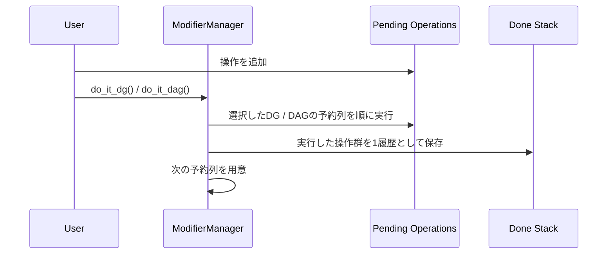

# ModifierManager

`ModifierManager` は `MDGModifier`、`MDagModifier`、`MAnimCurveChange`による変更を
まとめて扱うための管理クラスです。

目的は、複数のDG / DAG操作とanimation curve編集を1つの作業単位として
undo / redoできるようにすることです。

## 基本方針

`MDGModifier` / `MDagModifier` は操作を溜めて `doIt()` で確定する command buffer として扱います。

一度 `doIt()` した modifier は閉じた履歴として保存し、次の操作には新しい modifier を使います。

DGの予約列には`MAnimCurveChange`を使用する編集も含められます。通常のDG操作と
animation curve編集の呼び出し順を保持し、1回の`do_it_dg()`を1つの実行済み履歴として
保存します。`ModifierManager`全体では、これら複数の実行済み履歴をまとめて扱います。

## lifecycle



## public API

```python
modifier_manager.dg_mod
modifier_manager.dag_mod
modifier_manager.queue_dg_modifier(callback)
modifier_manager.queue_anim_curve_change(callback)
modifier_manager.do_it_dg()
modifier_manager.do_it_dag()
modifier_manager.undo_it()
modifier_manager.redo_it()
modifier_manager.clear()
modifier_manager.rollback()
```

`record_pending_dag_parent()` と `would_create_dag_cycle()` は、
DAG `NodeOperator` が未実行の親関係を管理するための連携 API です。
通常の利用コードから直接呼ぶ必要はありません。

## 使用例

```python
import bd_util as bdu

mod = bdu.ModifierManager()
nodes = bdu.Nodes(modifier_manager=mod)

node = nodes.create.plusMinusAverage(name="test_pma")
node.input1D[0].set(1.0)
node.input1D[1].set(2.0)

mod.do_it_dg()

mod.undo_it()
mod.redo_it()
```

## DG / DAG の混在

DG と DAG の操作は 1 つの `ModifierManager` に混在できます。

ただし `MDGModifier` に溜まった操作は `do_it_dg()`、`MDagModifier` に溜まった操作は `do_it_dag()` で確定します。

undo時は実行済み履歴を逆順に戻し、各履歴内の操作も逆順に`undoIt()`します。

redo時は元の順序で再実行します。native modifierには`doIt()`、animation curveの
変更キャッシュには`redoIt()`を呼びます。

## animation curve編集の予約

`queue_anim_curve_change(callback: Callable[[MAnimCurveChange], None]) -> None`は、
変更キャッシュを受け取るcallbackをDGの予約列へ追加します。callbackは初回の
`do_it_dg()`でのみ呼ばれ、通常のDG操作の間でも予約した順序で実行します。

callbackでは、渡されたキャッシュを`MFnAnimCurve`の`change`引数へ渡して編集します。
scene上のカーブの取得もcallback内で行えば、その直前に予約した作成・接続・キー設定を
反映した状態から編集できます。Undoではキャッシュの`undoIt()`、Redoでは`redoIt()`を
使用し、callback自体は再実行しません。

このAPIは`KeyframeManager.set()`のAPI経路と、挿入・tangent変更・キー削除が使用します。
通常の利用コードは`plug.keyframe`経由で操作し、独自のanimation curve編集を組み込む場合に
だけcallbackを直接予約します。callback内の変更は必ず渡されたキャッシュへ記録し、
別のmodifierの直接実行やキャッシュを渡さないAPI編集を混ぜないでください。
キャッシュに記録されない変更はundoや失敗時の復元の対象になりません。

`MAnimCurveChange`はノードの作成・接続・削除を記録するものではありません。
これらはDGの変更として同じmanagerへ予約します。`KeyframeManager.delete_anim_curve()`も
この分担に従います。

## 実行時に対象を解決するDG操作

`queue_dg_modifier(callback: Callable[[MDGModifier], None]) -> None`は、実行時のsceneを
参照してDG操作を組み立てるcallbackを予約します。callbackは初回の`do_it_dg()`で
一度だけ呼ばれ、渡されたmodifierへ操作を積みます。その直後にmanagerがmodifierの
`doIt()`を実行します。Undo / Redoは同じmodifierの`undoIt()` / `doIt()`を使用し、
callbackを呼び直して対象を再探索することはありません。

callback内では渡されたmodifierへ予約するだけにし、`doIt()`や別のscene編集を
直接実行しないでください。通常のDG予約やanimation curve編集と同じ順序・履歴で
管理され、callbackまたはmodifier実行の失敗も同じ実行境界の復元対象になります。

`KeyframeManager.set()`は、この入口で実行時のscene状態から編集経路を選択します。
cmdsへ委譲する場合は供給されたmodifierへcommandを予約し、API経路では後続の
`queue_anim_curve_change()`で編集します。これにより、作成から追加・上書きまでを
同じ実行境界へ積み、Undo / Redoでは初回に選択した経路の記録を再利用できます。

`KeyframeManager.delete_anim_curve()`はこの入口を2回使用します。実行時に見つけた
カーブの全出力接続を先に切断・反映し、その後に別のmodifierでカーブを削除します。
切断と削除を同じnative modifierへまとめると、接続先ノードまで削除される場合が
あるため、内部の実行を分けます。利用側の`do_it_dg()`は1回のままで、Undo時は
カーブノードの復元、出力接続の復元の順に戻します。

`queue_dg_modifier()`と`queue_anim_curve_change()`は現在のDG bufferを区切り、
後続の操作用に新しい`MDGModifier`を用意します。`dg_mod`を直接使用する場合は
各操作時に取得し、これらの予約methodやkeyframe編集、`do_it_dg()`をまたいで
古いmodifierを再利用しないでください。bufferを区切るだけではsceneへ反映しません。

## 未実行の DAG 親関係

DAG `NodeOperator` 経由の作成・親変更では、現在の `MDagModifier` に積まれた
未実行の直接親を `ModifierManager` が内部的に記録します。
現在のシーン階層とこの記録を組み合わせることで、未作成ノードを含む循環した
親変更を `do_it_dag()` より前に拒否します。

この記録は `do_it_dag()` の成功後、または `clear()` で破棄します。

## redo の扱い

`undo_it()` 後、`redo_it()` を呼ぶと履歴を再実行します。

新しい `do_it_dg()` / `do_it_dag()` が実行されると redo stack は破棄されます。

これは一般的な undo / redo と同じ扱いです。

## modifier実行中の失敗

`do_it_dg()` / `do_it_dag()`の途中で例外が発生した場合は、失敗した操作の部分変更と、
同じ実行境界内ですでに成功した操作を逆順に戻します。DG操作とanimation curve編集を
混在させた場合も、その1回の実行で反映した変更全体の復元を試みます。失敗した操作を
再実行しないよう、DG / DAG両方のpending操作、未実行の親関係、redo履歴を破棄します。
それ以前の実行境界で成功した履歴は保持するため、直接利用する呼び出し側は
`undo_it()`や`rollback()`でその履歴も戻せます。

`redo_it()`の途中で失敗した場合も、失敗した履歴内の部分変更を復元し、残りのredoと
pending操作を破棄します。それ以前の履歴の再実行が成功していれば、undo可能な状態で
保持します。

復元自体でも例外が発生した場合は、元の実行例外へnoteを付加して
再送出します。この場合は変更が残る可能性があります。破棄された失敗履歴を
managerから再実行したり、再度undoしたりはしません。

## clear

`clear()`は未実行のmodifier・callback、done stack、redo stackをすべて初期化します。
scene上の変更は戻しません。変更も戻して履歴を破棄する場合は`rollback()`を使用します。

テストや一時的な作業単位を破棄したい場合に使います。

## MPxCommand との関係

`MPxCommandBase`はcommandごとに一つの`ModifierManager`と、それを共有する`Nodes`を
保持します。command側の`undoIt()`では`modifier_manager.undo_it()`、`redoIt()`では
`modifier_manager.redo_it()`を呼びます。

初回実行の途中で失敗した場合は`rollback()`が実行済み履歴を逆順にundoし、pending、
done、redoの全状態を破棄します。通常の`undo_it()`と異なり、redo用履歴は残しません。
modifier実行中の失敗では、上記の部分変更の復元に続いて、command基盤がそれ以前の
成功済み履歴をrollbackします。

operationとMPxCommandの責務、登録、型付きfacadeを含む運用方針は
[MPxCommand](../mpx_command.md)を参照してください。

## 注意点

- `set_direct()` は `ModifierManager` に積まれません。
- `maya.cmds` や OpenMaya の直接 `doIt()` など、manager 外の操作は manager の undo / redo 対象外です。
- 1 つの command / 1 つの作業単位につき 1 つの `ModifierManager` を使うのが基本です。
