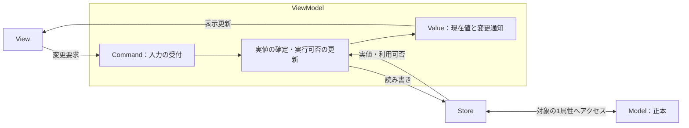

# このパッケージでのMVVMの役割

このページは、現在のbool UI基盤を例に、各名称の役割と使い分けを説明します。
具体的な引数やサンプルの実行方法は[UI README](README.md)、内部実装の判断理由は
[bool bindingの設計・保守メモ](bool_binding_design.md)を参照してください。

## 名称と担当

基本となる役割はModel・ViewModel・Viewです。このパッケージでは、値へのアクセスを
Store、表示用の現在値をValue、変更要求をCommandとして分け、これらを利用しやすく
組み立てるBindingを提供しています。利用時にすべてを手作業で作る必要はありません。

以下の「正本」は、値を確定するときの基準となる実データを指します。

| 名称 | 担当 | 現在の実装・例 |
| --- | --- | --- |
| **Model** | toolのデータと、そのデータに適用する規則を持つ。同期する値の正本になる。 | 利用者のdataclassやpropertyを持つobject、Maya nodeとその属性 |
| **Store** | Model内の1つの値を、共通の方法で読み書きする。利用可否・書き込み可否も公開する。 | 契約は`BoolValueStore`。実装は`PythonBoolAttributeStore`、`MayaBoolPlugStore` |
| **Value** | Viewが共通に読む現在値を保持し、変化を通知する。公開APIは読み取り専用。 | `BoolValue`の`value`と`changed` |
| **Command** | 値の変更要求を受け付け、ViewModelの処理へ渡す。実行可否を公開する。 | `SetBoolCommand`の`execute()`、`can_execute`、`can_execute_changed` |
| **ViewModel** | Storeへの読み書きを仲介して実値を確定し、ValueとCommandの状態を更新する。Viewにはこの2つを公開する。 | `BoolViewModel` |
| **View** | 値を表示し、入力をCommandへ渡す。複数のViewが同じViewModelを参照できる。 | `BoolCheckBox`などのQt Widget、Mayaを同期先にする`MayaBoolPlugView` |
| **Binding** | Storeと専用ViewModelの組み立て、利用者向けの操作、同期の終了と寿命管理をまとめる。 | `BoolBinding`、`MayaBoolBinding`、`MayaBoolPlugBinding` |

Model・Store・ViewModelなどは役割の名前です。Modelには、この基盤専用の基底クラスを
継承する必要はありません。また、`BoolValueStore`はModel全体ではなく、1つのbool値を
扱うための契約です。Storeを使うこと自体が、ファイルへの保存や永続化を意味するわけではありません。

## 入力と表示の流れ

Storeを使う構成では、次のように処理します。図のCommandとValueはViewModelが保持する部品です。



チェックボックスを操作した場合は、次の順になります。

1. Viewが入力をCommandへ渡す。
2. CommandがViewModelの変更処理を呼び出す。
3. ViewModelがStoreを通して正本を読み書きし、書き込み後の実値を受け取る。
4. ViewModelがその実値をValueへ反映する。
5. Valueの変更通知を受けた各Viewが表示を更新する。

setterが要求値を補正・拒否する場合も、表示には書き込み後の実値を使います。
同じViewModelにつながるView同士が、互いのチェック状態などを直接コピーする構成にはしません。
`BoolStatusLabel`のように、表示だけを行うViewもあります。

正本が外部ですでに変更された場合は、Storeから読み直してValueへ反映します。
たとえばPythonのdataclassへの直接代入後は`binding.refresh()`を呼びます。
`MayaBoolPlugStore`ではMaya callbackがこの読み直しを行います。
これらは確定済みの値を受け取る処理なので、Commandで再度書き込む必要はありません。

## Value・Command・ViewModelの違い

**Valueは「今どうなっているか」、Commandは「こう変更してほしい」を表し、
ViewModelが両者とStoreを仲介します。**

StoreありのValueは、正本を毎回読み取るpropertyではなく、最後に同期した確定値です。
Pythonデータを直接変更してから`refresh()`するまでの間は、正本とValueが異なることがあります。
低レベルAPIでStoreなしの`BoolViewModel`を作る場合は、Valueがメモリ上の値を保持します。

`Value.changed`は公開値が変化したときだけ通知します。一方、`Command.executed`は要求を
処理した通知なので、同じ値の要求など、実値が変わらない場合にも通知することがあります。
画面や他の部品を確定値に連動させるときは、通常`binding.changed`を使います。

`SetBoolCommand`はMayaのundo commandとは別のものです。Pythonデータの変更をMaya undoへ
登録したり、PythonとMayaをまとめて巻き戻したりする機能は持ちません。

現在の`BoolViewModel`は**1つのbool値の同期**を担当します。tool全体の状態や、複数属性を
組み合わせた業務上の判断を自動的に引き受けるクラスではありません。

## Bindingを使うと、利用者が書く部分

通常の利用では、Modelを用意し、Bindingを作ってViewへ渡します。
次は[最小サンプル](../../python/bd_util/_sample/maya/ui/bool_sample/minimal.py)と同じ構成のWidgetです。
Windowの作成・表示はサンプルや[UI README](README.md)の方法を使ってください。

```python
from dataclasses import dataclass

from bd_util.ui import BoolBinding, BoolCheckBox, qt


@dataclass
class ToolData:
    visible: bool = True


class ToolWidget(qt.QWidget):
    def __init__(
        self,
        data: ToolData,
        parent: qt.QWidget | None = None,
    ) -> None:
        super().__init__(parent)
        self.binding = BoolBinding.from_attribute(data, "visible", parent=self)
        self.check_box = BoolCheckBox(self.binding, "Visible", self)
        layout = qt.QVBoxLayout(self)
        layout.addWidget(self.check_box)
```

この例では、`data`がModel、`self.check_box`がViewです。
`from_attribute()`が`PythonBoolAttributeStore`を作り、Bindingが専用のViewModelへ接続します。
ValueとCommandはViewModelの内部で作られます。

BindingをViewへ渡した場合も、Viewは内部でそのViewModelを取り出して使います。
`BoolCheckBox(self.binding.view_model, "Visible", self)`という渡し方も可能です。

| 通常使うAPI | 内部の対応・意味 |
| --- | --- |
| `binding.value` | `binding.view_model.value.value`。現在公開している`bool`値を読む。 |
| `binding.changed.connect(slot)` | `binding.view_model.value.changed`へ接続する。同じsignalへの入口。 |
| `binding.set_value(False)` | `binding.view_model.set_value_command.execute(False)`。Viewと同じ経路で変更を要求する。 |
| `binding.refresh()` | Storeの実値と書き込み可否をViewModelへ読み直す。 |
| `binding.store` | 接続されている具体的なStoreへアクセスする。 |
| `binding.dispose()` | 入力と同期を終了する。同期元のPythonデータやMaya nodeは削除しない。 |

`binding.view_model.value`は`BoolValue`というobjectで、`binding.value`は`bool`そのものです。
また、`set_value()`の戻り値は正本の実値が変わったかどうか、`refresh()`の戻り値は公開値が
変わったかどうかです。Store実装の`write()`が返す「書き込み後のbool値」とは意味が異なります。

`changed`への接続だけでは、接続時の現在値は通知されません。Widget同士を連動させる場合は、
`binding.value`で初期状態を反映したうえで`changed`へ接続します。
例は[複数属性のサンプル](../../python/bd_util/_sample/maya/ui/bool_sample/multi_attribute/widget.py)を参照してください。

Bindingは、この流れを扱いやすくする入口です。独立した値の正本を追加する役割はありません。
Qt Widgetの種類・ラベル・レイアウトは利用側で選ぶため、BindingはQt Viewを自動作成しません。

## Maya plugは、正本にもViewにもなる

Maya側の役割は、どちらのデータを正本にするかで変わります。
以下の`plug`には、既存のbool属性を表す`BoolPlugOperator`を渡します。

| 構成 | 利用するBinding | Maya側の役割・初期同期 |
| --- | --- | --- |
| Pythonデータを編集する | `BoolBinding.from_attribute(data, "visible")` | Mayaとの同期なし。Python属性を読む。 |
| Pythonデータを正本としてMayaへも反映する | `MayaBoolBinding.from_attribute(data, "visible", maya_plug=plug)` | `MayaBoolPlugView`。作成時にPython値をMayaへ反映する。 |
| Mayaの値を正本として編集する | `MayaBoolPlugBinding(plug)` | `MayaBoolPlugStore`。作成時にMayaの現在値を読む。 |

`MayaBoolBinding`と`MayaBoolPlugBinding`は`bd_util.maya.ui`からimportします。
前者は、Mayaへの同期を付けられるPython Store向けのBindingです。
後者は、Maya Storeの作成・接続・callbackの終了までまとめるBindingです。

MayaがViewの場合も、Maya側の操作を受け取れます。その入力はCommandへ渡し、Pythonの正本に
適用してから実値を反映します。MayaがStoreの場合は、Maya側ですでに変更された正本を読み直します。
同じMaya plugへのアクセスでも、「変更要求」か「正本の変更通知」かが異なります。

## toolへ組み込むときの分担と寿命

| 追加したい内容 | 主に置く場所 |
| --- | --- |
| tool固有のデータ、値を受け入れるための規則 | Modelの属性・property・処理 |
| 新しいデータの読み書き方法 | `BoolValueStore`の契約を実装するStore |
| 同じbool値を別の形で表示・入力するWidget | View。既存のBindingまたはViewModelを受け取る。 |
| 複数属性の配置、表示・有効状態の連動 | tool側のWidget。必要ならtool固有のViewModelなどへまとめる。 |
| Windowの表示・再表示・終了 | `MayaWindowController`などのController |

1つの属性を複数のViewで扱う場合は、同じBindingまたはViewModelを渡します。
別々の属性を扱う場合は、それぞれのBindingを作ります。UI上の無効化は表示・操作の都合であり、
Pythonからの変更も含めて守る必要がある規則はModel側にも設けます。

寿命は`parent`と明示的な終了で管理します。

- 1つのWidget内で完結するBindingは、例のように`parent=self`でそのWidgetに所有させる。
- 複数Windowで共有するBindingは、各Windowから独立した共通ownerに所有・保持させる。
- Viewは受け取ったBindingやViewModelを参照するだけで、共有する相手を所有・終了しない。
- 同期が不要になったらownerを破棄するか`binding.dispose()`する。Viewの個数だけで同期の寿命を決めない。

Bindingは専用ViewModelを所有しますが、外部から渡されたStoreの所有権を一律には引き取りません。
`MayaBoolBinding`が作るMaya Viewや、`MayaBoolPlugBinding`が作るMaya Storeは、それぞれのBindingが
管理します。詳細な所有関係とcallbackの終了順は[設計・保守メモ](bool_binding_design.md)を参照してください。
